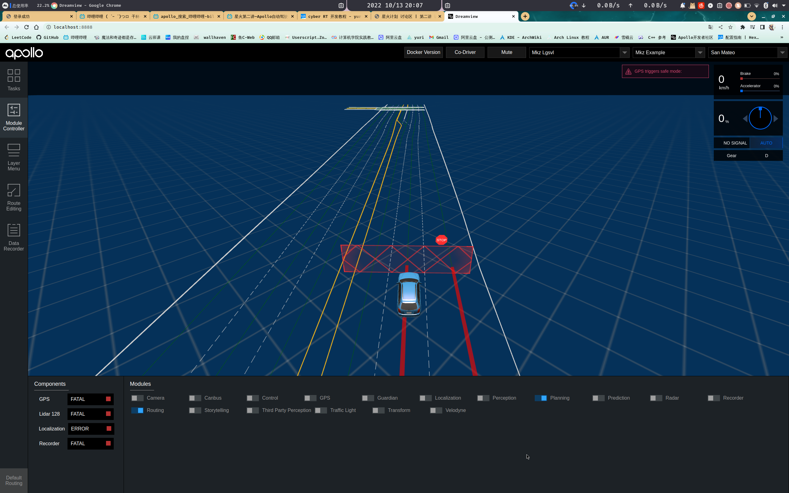
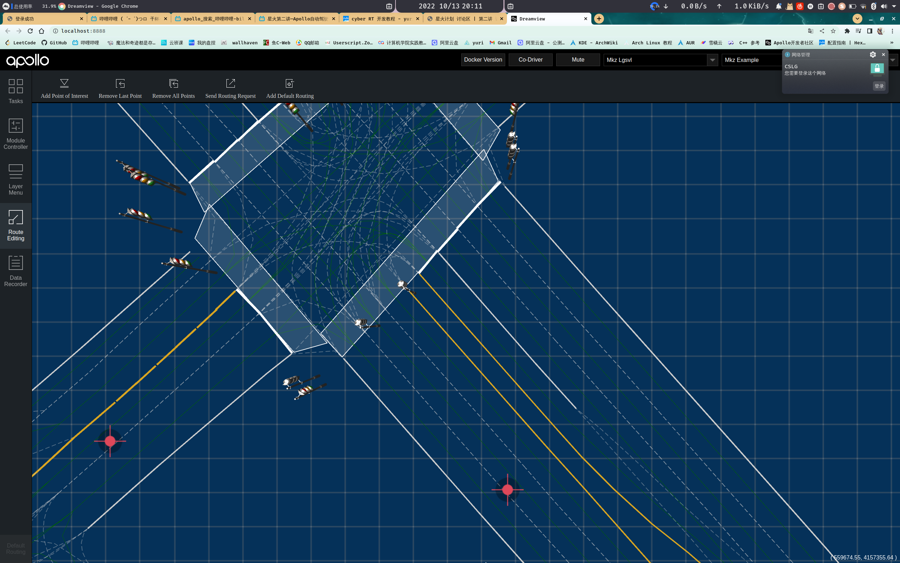

# apollo 星火计划
> 学习视频 [apollo星火计划](https://www.bilibili.com/video/BV1514y1s7kT/?spm_id_from=333.788&vd_source=b7e1ff814885b361e6eabd7f6aece347) 

## 第二节视频详解

1. 可以使用 PNC Monitor 工具查看汽车运行时的具体细节参数
2. 使用 cyber_monitor 工具查看正在运行的话题
3. 使用 Sim Control 工具进行仿真调试开发
   
    1. 进入apollo dreamview 环境
    2. 勾选 Sim Control 功能
    3. 进入模块设置 勾选 planning 模块和 Routing 路由模块
    4. 
    5. 进入Routing EIDITing 设置路由
    6. 点击一个点作为起点，再点击一个点作为终点
    7. 
    8. 点击右上角的 Send Routing Request 发送路由数据
    9. 然后查看汽车运行状况就行

4.

