# html基础  
## html的基础框架结构  
+ ```<!DOCTYPE html> ```HTML文件开头，表示这是由HTML5编写的文件  

+ ```<html></html>``` html的主体框架  

    + ```<head></head>```  网页的头部，用来标识网页的各种参数，样式  

        + ```<title>网页标题</title>```

        + ```<meta>```元信息标签

            + ```<meta charset="UTF-8"> ```指定html文档编码
            + ```<meta name="viewport" content="width=device-width, initial-scale=1.0">``` 实现网页自适应
            + ```<meta name="keywords" content=优化搜索引擎"> ```
            + ```<meta name="description" content=优化搜索引擎"> ```
            + ```<meta http-equiv="refresh" content="100; https://2078.site" >``` 设置网页自动刷新和跳转
            + ```<meta http-equiv="X-UA-Compatible" content="IE=edge">```指定网页兼容性

        + ```<link>``` 用于添加外部的东西

            + ```<link rel="stylesheet" type="text/css" href="">```引用外部样式表
            + ```<link rel="icon" type="image/x-icon" href="">``` 指定网页的图标

        + ```<style type="text/css"><style>```内部样式表

            + ```@import url("css文件路径");```引入外部样式表
            + 通过各种选择器定义样式

        + ```<base href="" target="_blank">``` 更改相对路径

    + ```<body></body>``` 网页的主体内容
        + 块级元素 独占一行

            + ```<p></p>``` 表示一个段落 
            + ```<h1></h1>``` h1标题，h1 - h6 依次类推
            + ```<br>``` 换行
            + ```<hr>``` 横线
            + ```<div></div>``` 就是一个无语意的块元素
            + ```<pre></pre>``` 预格式化内容，通常会保留空格和回车，字符也是等宽大小
            + 页面结构元素 语义元素，需要结合CSS进行布局
                + header 定义文档或节的页眉
                + nav 定义导航链接的容器
                + section 定义文档中的节
                + article 定义独立的自包含文章
                + footer 定义文档或节的内容
                + details 定义额外的的细节
                + summary 定义details元素的标题

            + 列表
                + ```<ul></ul>``` 无序列表

                    + ```<li></li>``` 列表项目默认实心点

                + ```<ol></ol>``` 有序列表

                    + ```<li></li>``` 列表项目默认1，2，3
                + ```<dl></dl>``` 普通列表
                    + ```<dt>内容</dt>``` 定义项目部分内容
                    + ```<dd>内容</dd>``` 定义描述部分内容

        + 行内元素 不独占一行

            + ```<b>内容</b>``` 内容加粗
            + ```<i>内容</i>``` 内容斜体
            + ```<big>内容</big>``` 字号加大
            + ```<small>内容</small>``` 字号变小
            + ```<tt>内容</tt>``` 打字机字体
            + ```<sup>内容</sup>``` 上标
            + ```<sub>内容</sub>``` 下标
            + ```<u>内容</u>``` 下划线
            + ```<del>内容</del>``` 删除线
            + ```<a></a>```超链接

                + ```<a href="这里是链接">替换文本</a>``` 指定链接指向页面的 URL
                + ```mailto:2078170658@qq.com``` 指向电子邮件
                + ```<target="_blank">``` 指定在何处打开超链接。

                    + _blank：在新窗口中打开
                    +  _parent：在当前的父窗口中打开
                    + _self：当前窗口打开
                    + _top：在整个窗口中打开
                    + framename：在指定的框架中打开
                
                + ```<a name="锚点名称">建立锚点</a>``` 建立一个锚点
                + ```<a href="#锚点名称">回到锚点</a>``` 设置链接指向一个锚点
                
            + ```<strong>文本</strong>``` 重要文本
            + `````` 图片

                + ```alt="文本"``` 替换文本
                + ```src="链接"```  图片地址

            + ```<span>内容</span>``` 无任何语义、
        
        + ```<table></table>``` table标签

            + ```<capiton></capiton>``` 表格标题
            + ```<td></td>``` 表格数据单元格
            + ```<tr></tr>``` 表格行标签
            + ```<th></th>``` 表格表头格标签
            + ```<thead></thead>``` 定义表格的表头
            + ```<tbody></tbody>``` 定义表格的主体
            + ```<tfoot></tfoot>``` 定义表格的页脚

        + HTML实体
            + 空格 ```&nbsp;``` 
            + 小于 ```&lt;``` 
            + 大于 ```&gt;``` 
            + &符号 ```&amp;``` 
            + 双引号 ```&quot;``` 
            + 版权 ```&copy;```
            + 注册商标 ```&reg;```
            + 乘号 ```&times;```
            + 除号 ```&divide;```
        
## HTML表单
+ ```<form></form>``` 定义供用户输入的表单

    + ```action=""``` 指定表单向何处发送数据，默认本网页
    + ```metho""``` 表示表单提交的方式

        + get 会暴露发送的数据，不安全
        + post 最常用的方式较安全
    
    + ```enctype=""``` 表示浏览器对发送给服务器的数据的编码格式。
    + ```target=""``` 规定在何处打开 action URL。、

### input 输入域 
+ type 类型值
    + 常用属性
        + alt 指定图像的说明文字
        + form 指定其所属的一个或多个表单 id 值
        + height 指定图像的高度（像素）
        + width	指定图像的宽度（像素）
        + list 指定一个数据列表，即 datalist 元素的 id 值
        + max 指定可接受的最大值，以便进行输入验证
        + maxlength	指定用户可以在文本框输入的最大字符数
        + min 指定可接受的最小值，以便进行输入验证
        + size 指定文本框的宽度

    + button 定义一个普通按钮  value 表示默认值
    ```
        <form>
            <input type="button" value="按钮">
        </form>
    ```
    显示效果：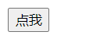
        
    + checkbox 多选框 
    ```
        <form>
            <input type="checkbox" name="fruit" value="check1">选项1<br>
            <input type="checkbox" name="fruit" value="check2">选项2<br>
            <input type="checkbox" name="fruit" value="check3">选项3<br>
        </form>
    ```
    显示效果： 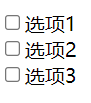
        
    + color 选择颜色
    ```
        <form>
            选择你要的颜色: <input type="color" name="yourcolor">
        </form>
    ```
    显示效果:  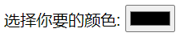

    + date 选择日期
    ```
        <form>
            选择你的生日: <input type="date" name="yourbirth">
        </form>
    ```
    显示效果:  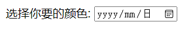

    + email 输入电子邮件
    ```
        <form>
            请输入你的电子邮件: <input type="email" name="youremail">
        </form>
    ```
    显示效果:  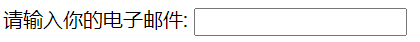

    + file 选择一个文件
    ```
        <form>
            选择一个文件: <input type="file" name=" yourfile">
        </form>
    ```
    显示效果:  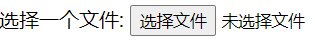

    + number 输入数字 min 表示最小，max表示最大
    ```
        <form>
            输入数字（1-99）: <input type="number" name="yournumber" min="1" max="99">
        </form>
    ```
    显示效果:  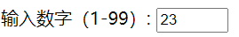

    + pawssword 输入密码，数据隐藏
    ```
        <form>
            请输入你的密码: <input type="password" name="yourpassword">
        </form>
    ```
    显示效果:  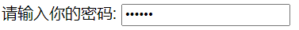

    + radio 单选框，name相同的只能选择一个
    ```
        <form>
            请选择你的性别: 
            <input type="radio" name="sex" value="nan">男
            <input type="radio" name="sex" value="nv">女
        </form>
    ```
    显示效果:  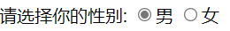

    + range 选择数字 min 表示最小，max表示最大
    ```
        <form>
            请打分（1-20）: <input type="range" name="yourpoint" min="1" max="20">
        </form>
    ```
    显示效果:  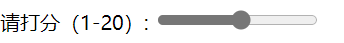

    + reset 重置表单所有输入
    ```
        <form>
            <input type="submit">
        </form>
    ```
    显示效果:  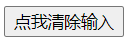

    + submit 提交按钮
    ```
        <form>
            <input type="submit">
        </form>
    ```
    显示效果:  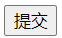

    + text 基本输入框
     ```
        <form>
            请输入你想对我们说的话：<input type="text" name="hello">
        </form>
    ```
    显示效果:  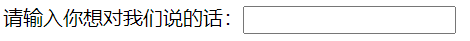

+ textarea 文本域  属性
    +  autofocus 指定在页面加载后文本区域自动获得焦点
    +  cols	指定文本区域的可见宽度
    +  disabled	禁用该文本区域
    +  form	指定文本区域所属的一个或多个表单
    +  maxlength 指定文本区域的最大字符数
    +  name 指定文本区域的名称
    +  placeholder 指定文本区域的占位提示文本
    +  readonly	指定文本区为只读
    +  required	指定文本区域为必填项
    +  rows	指定文本区内的可见行数
    +  wrap 指定在表单提交时，如何处理文本区域的自动换行

```
    <form>
        <textarea name="wenben" >默认提示会在这里</textarea>
    </form>
```
显示效果:  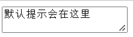

+ select 下拉列表

    + 常用属性
        + autofocus	指定在页面加载后文本区域自动获得焦点
        + disabled	指定该下拉列表被禁用
        + form	指定所属表单
        + multiple	指定该下拉列表支持多个选项
        + name	指定该下拉列表的名称
        + required	指定文本区域是必填的
        + size 指定下拉列表中可见选项的数目

    +  ```
        <select autofocus>
            <option>选项1</option>
            <option>选项2</option>
            <option>选项3</option>
        </select>
        ```
    显示效果：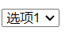


#### 参考资料  
+ 云班课ppt
+ 小甲鱼web学习网站 https://man.ilovefishc.com/html5/