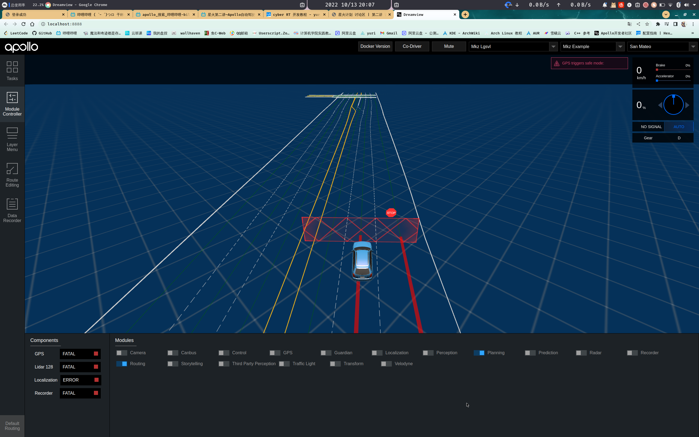
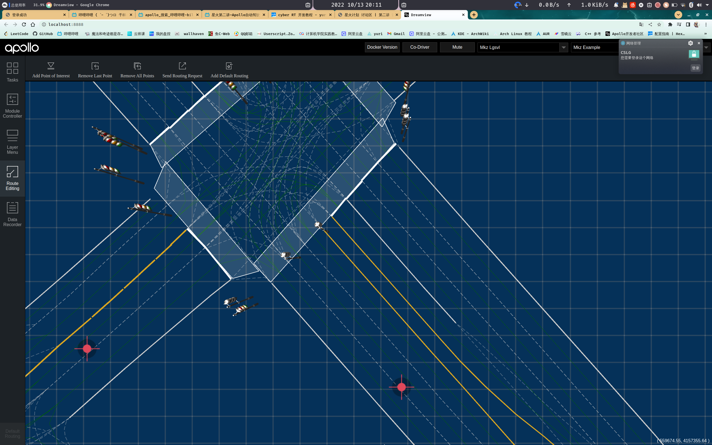

# apollo 星火计划
> 学习视频 [apollo星火计划](https://www.bilibili.com/video/BV1514y1s7kT/?spm_id_from=333.788&vd_source=b7e1ff814885b361e6eabd7f6aece347) 

## 第二节视频详解

1. 可以使用 PNC Monitor 工具查看汽车运行时的具体细节参数
2. 使用 cyber_monitor 工具查看正在运行的话题
3. 使用 Sim Control 工具进行仿真调试开发
   
    1. 进入apollo dreamview 环境
    2. 勾选 Sim Control 功能
    3. 进入模块设置 勾选 planning 模块和 Routing 路由模块
    4. 
    5. 进入Routing EIDITing 设置路由
    6. 点击一个点作为起点，再点击一个点作为终点
    7. 
    8. 点击右上角的 Send Routing Request 发送路由数据
    9. 然后查看汽车运行状况就行

## 规划模块

### 障碍物绕行仿真实验

1. apollo实验室添加[障碍物场景](https://apollo.baidu.com/community/article/175) 没有profile模块的可以去云实验室，或者看我博客主页文章
2. 进入apollo docker环境
3. 运行 `./scripts/bootstrap.sh` 启动dreamviem 
4. 打开 sim control 功能
5. 进入 profile 模块，下载刚刚同步的障碍物场景
6. 右上角选择 刚刚的障碍物场景
7. 打开 左边 Module Controller 模块功能
8. 打开 planning prediction routing 三个模块的功能
9. 打开左边 RouteEditing 选择起点和重点，然后发送路由信息就可以看到绕行场景

### 仿真绕行配置

#### 配置绕行距离

> 配置文件目录 ： /apollo/modules/planning/conf/planning.conf


在29行左右添加 --obstacle_lat_buffer=1 默认是1米，可以改成1.5米

```makefile
27 # --use_front_axe_center_in_path_planning=true
28 # --obstacle_lon_start_buffer=0.4
29 # --obstacle_lon_end_buffer=0.4
30 --obstacle_lat_buffer=1
31 # 将超车的横向距离改成 1.5米，默认是1米

```

#### 配置检测到障碍物时超越速度

> 配置文件目录：  /apollo/modules/planning/conf/planning_config.pb.txt

```
 	default_task_config: {
149   task_type: SPEED_BOUNDS_PRIORI_DECIDER
150   speed_bounds_decider_config {
151     total_time: 7.0
152     boundary_buffer: 0.25
153     max_centric_acceleration_limit: 2.0
154     point_extension: 0.0
155     lowest_speed: 2.5
156     collision_safety_range:1.6 //设置横向检测距离
157     static_obs_nudge_speed_ratio: 0.1  // 设置地图限速百分比，apollo地图默认限速60
158     dynamic_obs_nudge_speed_ratio: 0.8
159   }
160 }
161 default_task_config: {
162   task_type: SPEED_BOUNDS_FINAL_DECIDER
163   speed_bounds_decider_config {
164     total_time: 7.0
165     boundary_buffer: 0.1
166     max_centric_acceleration_limit: 2.0
167     point_extension: 0.0
168     lowest_speed: 2.5
169     static_obs_nudge_speed_ratio: 0.1 // 设置横向超越速度限制
170     collision_safety_range:1.6 // 这里和上面一样
171     dynamic_obs_nudge_speed_ratio: 0.8
172   }
173 }

```

## 控制模块

### 星火计划笔记

> 瞎写

#### 作用

模拟人类控制汽车

精确性 Steady State Error

稳定性 Stability, Obershoot

快速行 Rise time, Peak time

鲁棒性 Robust 不容易受干扰


on lane planning 主要处理有车道线

open space planning task  主要处理没有车道线比如自主停车，这类的。


Reference Line 参考路径


## 常见类详解


