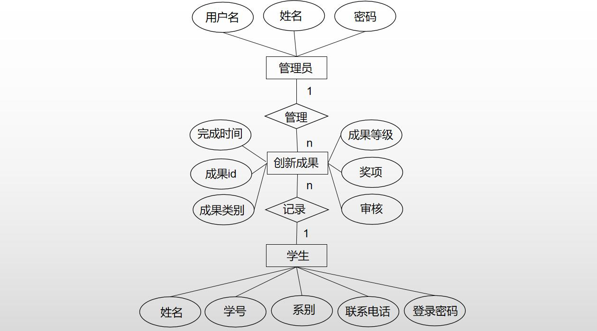

[TOC]

> 数据库设计

| 学号 | 092221208 | 092221220 | 092221232 | 092221235 |
| :--- | --------- | --------- | --------- | --------- |
| 姓名 | 廖华勇    | 杨先锋    | 何雪芸    | 王雨欣    |
| 教师 | 闫海英    | 闫海英    | 闫海英    | 闫海英    |

# 实验目的

1. 掌握数据库设计的基本步骤

1. 培养综合运用数据库设计方法的能力

# 实验预习

## 数据库设计步骤

> 数据库设计的基本步骤

1. 需求分析：确定数据存储的需求和业务流程，包括数据类型、数据量、处理方式、应用场景等，进而确定数据库系统的规模和范围。
2. 概念设计：根据需求分析结果，构造出概念模型，包括实体、属性、关系等，使用概念模型绘制 E-R 图并进行检查和优化。
3. 逻辑设计：在概念设计的基础上，转换为逻辑模型，包括表格、关系、主键、外键、索引等，使用逻辑数据模型表示数据的结构和属性。
4. 物理设计：将逻辑模型转化为数据库物理模型，确定列的名称、数据类型、长度、精度、约束条件等，并确定表格的物理结构、索引、存储引擎、分区等。
5. 实施和测试：根据物理模型和架构设计，实施数据库系统并进行测试，包括数据插入、查询、更新、删除等关键操作，并根据测试结果进行修改和优化。
6. 运维和维护：对数据库系统进行运维和维护，包括备份、恢复、监控、优化等，确保数据库系统运行稳定、可靠、高效

## er模型转换原则

> E-R模型向逻辑模型转换的基本原则是根据实体、属性、关系和约束等要素进行转换，并进行适当的扩充和调整

1. 实体与表格的转换：E-R 模型中的实体（Entity）对应逻辑模型中的表格（Table），将每个实体定义为一个表格，并确定表格的名称、列名、数据类型、长度、约束条件等。
2. 属性与列的转换：E-R 模型中的属性（Attribute）对应逻辑模型中的列（Column），将每个属性声明为表格的一个列，并根据属性的数据类型和特性选择合适的列类型和长度。
3. 关系与键的转换：E-R 模型中的关系（Relationship）对应逻辑模型中的键（Key），将关系转换为主键、外键或联合键，并确定键的名称、数据类型、长度、约束条件等。
4. 约束条件的转换：E-R 模型中的约束条件（Constraint）包括实体完整性、属性约束、关系约束等，这些约束条件需要转换为 SQL 中的约束条件，例如 NOT NULL、UNIQUE、PRIMARY KEY、FOREIGN KEY、CHECK 等。
5. 数据模型的优化：根据需求的具体情况，对表格、列、键和索引等进行优化和调整，以达到更好的性能、可维护性、可扩展性等目的。

# 实验内容

## er模型

ss

## 数据库表设计

表1：学生表（student）

| 字段名 | 类型        | 描述         |
| ------ | ----------- | ------------ |
| id     | int         | 学号（主键） |
| name   | varchar(10) | 姓名         |
| dept   | varchar(20) | 系别         |
| tel    | varchar(20) | 联系电话     |
| pwd    | varchar(10) | 登录密码     |

表2：创新成果表（Innovation）

| 字段名     | 类型        | 描述                                                |
| ---------- | ----------- | --------------------------------------------------- |
| id         | int         | 成果编号（主键）自增长                              |
| stu_id     | int         | 学生学号（外键关联学生表中学号字段）                |
| category   | varchar(20) | 成果类别（大创项目、竞赛等）                        |
| level      | enum        | 成果等级（国家级、省级、校级）- 枚举类型            |
| finishTime | datetime    | 完成时间                                            |
| prize      | enum        | 奖项（一等奖、二等奖、三等奖）                      |
| review     | enum        | 审核结果 (1 同过 0 未审核 -1 审核未通过) 默认未审核 |

表3：管理员表（Admin）

| 字段名 | 类型        | 描述             |
| ------ | ----------- | ---------------- |
| id     | int         | 管理员ID（主键） |
| name   | varchar(20) | 姓名             |
| pwd    | varchar(50) | 登录密码         |

## 创建表格

```sql
# 创建学生表（student）：
create table student (
  id int primary key not null,
  name varchar(10) not null,
  dept varchar(20),
  tel varchar(20),
  pwd varchar(10) not null
);
```

```sql
# 创建创新成果表（innovation）：
create table innovation (
    id int primary key auto_increment,
    stu_id int not null,
    category varchar(20) not null,
    level enum('国家级', '省级', '校级') not null,
    finish_time date not null,
    prize enum('一等奖', '二等奖', '三等奖') not null,
    review enum('1', '0', '-1') not null default '0',
    foreign key (stu_id) references student(id),
    constraint fk_innovation_stu_id foreign key (stu_id) references student(id)
        on update cascade on delete cascade
);
```

```sql
# 创建管理员表（admin）：
create table admin (
  id int primary key not null,
  name varchar(20),
  pwd varchar(50) not null
);
```

## 数据库功能设计

### 注册功能

> 管理员和学生进行注册的功能

```sql
# 学生注册
create function stu_register(
    id_ int , name_ varchar(10),dept_ varchar(20),tel_ varchar(20),pwd_ varchar(10))
returns varchar(20) deterministic
begin
    declare no int;
    set no = (select id from student where id = id_);
    if no is not null then
        return '你已经注册过捏';
    end if;
    insert into student (id, name, dept, tel, pwd) values
        (id_, name_, dept_, tel_, pwd_);
    return '注册成功！';
end;
```

```sql
# 管理员注册:
create function adm_register(
    id_ int , name_ varchar(10),pwd_ varchar(10))
    returns varchar(20) deterministic
begin
    declare no int;
    set no = (select id from admin where id = id_);
    if no is not null then
        return '你已经注册过捏';
    end if;
    insert into admin (id, name, pwd) values
        (id_, name_, pwd_);
    return '注册成功！';
end;
```

### 学生信息登记

> 学生自行登记获奖信息

```sql
create function record_info(
    id_ int, category_ varchar(20), level_ enum('国家级','省级', '校级'),
    finish_time_ date, prize_ enum('一等奖', '二等奖', '三等奖'))
returns varchar(20) deterministic
begin
    if (select id from student where id = id_) is null then
        return '没有该学生!';
    end if;
    insert into innovation (stu_id, category, level, finish_time, prize) values
        (id_, category_, level_, finish_time_, prize_);
    return '信息添加成功!';
end;
```

### 学生信息查询

> 学生信息查询

```sql
# 查询该学号所有记录 输入参数 ： 学号
create procedure get_info(in stu_id_ int)
begin
    select innovation.stu_id as '学号', name as '姓名', category as '获奖类型',
        level as '获奖等级', finish_time as '获奖日期', prize as '奖项'
        from innovation, student where stu_id = stu_id_ and innovation.stu_id = student.id;
end;
```

```sql
# 按年份查询 输入参数: 学号， 需要查询的年份
create procedure get_info_year(in stu_id_ int, in year int)
begin
    select innovation.stu_id as '学号', name as '姓名', category as '获奖类型',
        level as '获奖等级', finish_time as '获奖日期', prize as '奖项'
    from innovation, student
        where stu_id = stu_id_ and innovation.stu_id = student.id
        and finish_time like concat(year, '%');
end;
```

```sql
# 按学期查询 输入参数： 学号，查询的学期
create procedure get_info_sem(in stu_id_ int, in sem enum('1', '2'))
begin
    select innovation.stu_id as '学号', name as '姓名', category as '获奖类型',
           level as '获奖等级', finish_time as '获奖日期', prize as '奖项'
    from innovation, student
    where stu_id = stu_id_ and innovation.stu_id = student.id
      and ((sem = 2 and (month(finish_time) between 3 and 8)) or
        (sem = 1 and (month(finish_time) not between 3 and 8)));
end;
```

### 学生信息修改

```sql
# 更新信息，并将审核状态改为未审核
create procedure change_info(in id_ int ,in  category_ varchar(20), in level_ enum('国家级','省级', '校级'),
                             in finish_time_ date, in prize_ enum('一等奖', '二等奖', '三等奖'))
begin
    update innovation set
        category = category_,
        level = level_,
        finish_time = finish_time_,
        prize = prize_,
        review = 0
    where stu_id = id_;
end;
```

### 管理员成果审核

```sql
# 查看所有未审核的信息
create procedure get_not_reviewed()
begin
    select * from innovation where review = 0;
end;
```

```sql
# 设置审核结果
create procedure set_review(in id_ int, in res enum('1', '-1', '0'))
begin
    update innovation set review = res where id = id_;
end;
```

### 管理员成果统计

```sql
# 按获奖年份统计
create view get_review_year as
    select  year(finish_time) as '获奖年份', count(*) as '获奖人数',
        group_concat(stu_id,'-', category,level, prize) as '详细信息'
        from innovation group by year(finish_time);

# 按获奖类别统计
create view get_review_cate as
select  category as '获奖类别', count(*) as '获奖人数',
        group_concat(stu_id,'-',level, prize) as '详细信息'
from innovation group by category;

# 按系别统计
create view get_review_cate as
select dept as '系别', count(*) as '获奖人数' ,
    group_concat(stu_id,'-',category, level, prize) as '详细信息'
    from student s, innovation i
    where s.id = i.stu_id
    group by dept;

# 按班级统计
create view get_review_cate as
select stu_id as '班级', count(*) as '获奖人数' ,
       group_concat(stu_id,'-',category, level, prize) as '详细信息'
from student s, innovation i
where s.id = i.stu_id
group by substr(stu_id, 1, 7);
```

### 学生信息历史记录

```sql
create table log(
  id int primary key  auto_increment,
  time datetime not null,
  action enum('插入', '更新', '删除') not null,
  val varchar(100)
);

# 插入日志更新
create trigger student_history
before insert on student
for each row
begin
    insert into log set
        time = now(),
        action = '插入',
        val = concat_ws(
        ' ',
        'id ->', new.id,
        'dept ->', new.dept,
        'name ->', new.name,
        'tel ->', new.tel,
        'pwd ->', new.pwd);
end;
```

## 实验总结

在本次数据库实验中，我们学习了关系型数据库的设计与操作，了解了 SQL 语言的基本语法和数据库管理系统的使用方法。通过实际操作，可以更好地理解数据库设计的过程，并能够熟练地使用 SQL 语句进行查询、更新等操作。
本次实验的主要内容是设计一个简单的创新成果展示系统，包括信息的存储、查询和更新等功能。在实验过程中，我们通过 Entity-Relationship 模型进行数据库设计，建立了学生表、创新成果表和管理员表，利用 SQL 语句进行对表数据的增删改查等操作。
在实验中，我们学会了如何使用 SQL 语句创建表、插入记录、更新数据和查询数据等常用操作，并了解了 SQL 语句的一些高级用法，比如联结查询和分组统计等。同时，在实验中也学会了使用 MySQL 数据库管理系统进行操作，掌握了数据库设计与管理的一些基本方法和技巧。
通过本次实验，我们不仅学到了理论知识，还锻炼了实际操作的能力，对数据库的管理和查询有了更深入的了解，这对我们今后的学习和工作都有很大的帮助。
